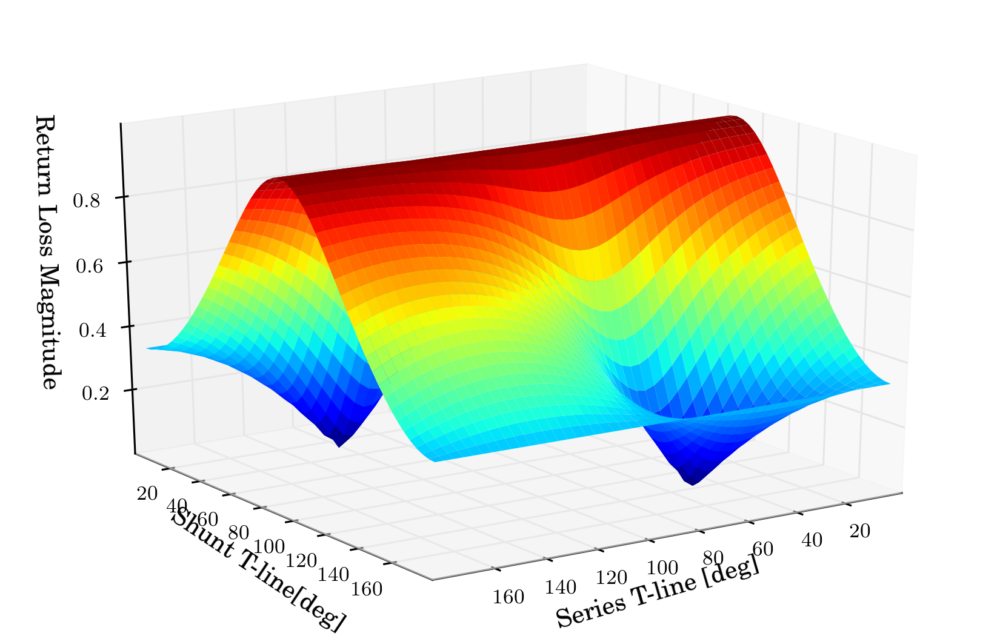

.. _example-matching_single_stub:
*********************************************
Circuit Design: Single Stub Matching Network
*********************************************

Introduction
--------
This example illustrates a way to visualize the design space for a single stub matching network. The matching Network consists of a shunt and series stub arranged as shown below, (image taken from R.M. Weikle's Notes)

.. figure::  ../images/single_stub_matching_diagram.png
   :align:   center
   :width:	400
   
   
A single stub matching network can be designed to produce maximum power transfer to the load, at a single frequency. The matching network has two design parameters:
 
 * length of series tline
 * length of shunt tline
  
This script illustrates how to create a plot of return loss magnitude off the matched load, vs series and shunt line lengths. The optimal designs are then seen as the minima of a 2D surface.

Script
------------

::

	import skrf as rf
	from pylab import * 
	
	
	# Inputs
	wg = rf.wr10 # The Media class
	f0 = 90 		# Design Frequency in GHz
	d_start, d_stop = 0,180 # span of tline lengths [degrees]
	n = 51 			# number of points
	Gamma0 = .5 	# the reflection coefficient off the load we are matching

	
	# change wg.frequency so we only simulat at f0
	wg.frequency = rf.Frequency(f0,f0,1,'ghz')
	# create load network 
	load = wg.load(.5) 
	# the vector of possible line-lengths to simulate at 
	d_range = linspace(d_start,d_stop,n)
	
	def single_stub(wg, d):
		'''
		function to return series-shunt stub matching network, given a 
		WorkingBand and the electrical lengths of the stubs
		'''
		return wg.shunt_delay_open(d[1],'deg') ** wg.line(d[0],'deg')
	
	# loop through all line-lengths for series and shunt tlines, and store
	# reflection coefficient magnitude in array
	output = array([[ (single_stub(wg, [d0,d1])**load).s_mag[0,0,0] \
		for d0 in d_range] for d1 in d_range] )
	
	
	# show the resultant return loss for the parameters space
	figure()
	title('Series-Shunt Stub Matching Network Design Space (2D)')
	imshow(output)
	xlabel('Series T-line [deg]')
	ylabel('Shunt T-line [deg]')
	xticks(range(0,n+1,n/5),d_range[0::n/5])
	yticks(range(0,n+1,n/5),d_range[0::n/5])
	cbar = colorbar()
	cbar.set_label('Return Loss Magnitude')
	
	from mpl_toolkits.mplot3d import Axes3D
	
	fig=figure()
	ax = Axes3D(fig)
	x,y = meshgrid(d_range, d_range)
	ax.plot_surface(x,y,output, rstride=1, cstride=1,cmap=cm.jet)
	ax.set_xlabel('Series T-line [deg]')
	ax.set_ylabel('Shunt T-line[deg]')
	ax.set_zlabel('Return Loss Magnitude')
	ax.set_title(r'Series-Shunt Stub Matching Network Design Space (3D)')
	draw()
	show()
	

Output 
------------

.. figure::  ../images/Series-Shunt_Stub_Matching_2D.png
   :align:   center
   :width:	800

