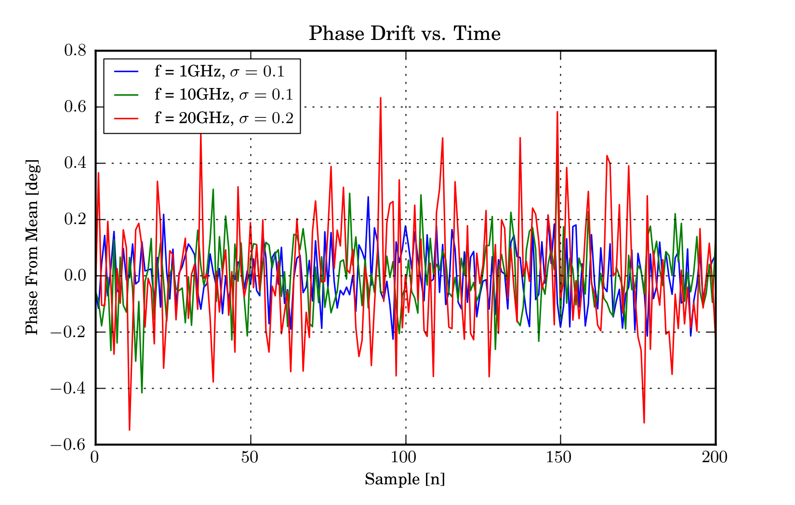

.. _example-vna-noise-analysis:
****************************
VNA Noise Analysis 
****************************

This example records a series of sweeps from a VNA to touchstone files, named in a chronological order. These are then used to characterize the noise of a VNA.

Touchstone File Retrieval
---------------------------
::

    import skrf as rf
    import os,datetime
    
    nsweeps = 101 # number of sweeps to take
    dir = datetime.datetime.now().date().__str__() # directory to save files in 
    
    myvna = rf.vna.HP8720() # HP8510 also available
    os.mkdir(dir)
    for k in range(nsweeps):
	    print  k 
	    ntwk = myvna.s11
	    date_string = datetime.datetime.now().__str__().replace(':','-')
	    ntwk.write_touchstone(dir +'/'+ date_string)
	    
    myvna.close()

Noise Analysis
--------------------
Calculates and plots various metrics of noise, given a directory of
touchstone files, as would be created from the previous script.

::

    import skrf as rf
    from pylab import * 
    
    dir = '2010-12-03' # directory of touchstone files
    npoints = 3 # number of frequency points to calculate statistics for
    
    
    # load all touchstones in directory into a dictionary, and sort keys
    data = rf.load_all_touchstones(dir+'/')
    keys=data.keys()
    keys.sort()
    
    # length of frequency vector of each network
    f_len = data[keys[0]].frequency.npoints
    # frequency vector indecies at which we will calculate the statistics
    f_vector = [int(k) for k in linspace(0,f_len-1, npoints)]
    
    #loop through the frequencies of interest and calculate statistics
    for f in f_vector:
	    # for legends
	    f_scaled = data[keys[0]].frequency.f_scaled[f] 
	    f_unit = data[keys[0]].frequency.unit	
    
	    # z is 1d complex array of the s11 at the current frequency, it is
	    # as long as the number of touchsone files
	    z = array( [(data[keys[k]]).s[f,0,0] for k in range(len(keys))])
	    phase_change = rf.complex_2_degree(z * 1/z[0])
	    phase_change = phase_change - mean(phase_change)
	    mag_change = rf.complex_2_magnitude(z-z[0])
	    
	    figure(1)
	    title('Complex Drift')
	    plot(z.real,z.imag,'.',label='f = %i%s'% ( f_scaled,f_unit))
	    axis('equal')
	    legend()
	    rf.smith()
    
	    figure(2)
	    title('Phase Drift vs. Time')
	    xlabel('Sample [n]')
	    ylabel('Phase From Mean [deg]')
	    plot(phase_change,label='f = %i%s, $\sigma=%.1f$'%(f_scaled,f_unit,std(phase_change)))
	    legend()
    
	    figure(3)
	    title('Phase Drift Distribution')
	    xlabel('Phase From Mean[deg]')
	    ylabel('Frequency Of Occurrence')
	    hist(phase_change,alpha=.5,bins=21,histtype='stepfilled',\
		    label='f = %i%s, $\sigma=%.1f$'%(f_scaled,f_unit,std(phase_change)) )
	    legend()
	    figure(4)
	    title('FFT of Phase Drift')
	    ylabel('Power [dB]')
	    xlabel('Sample Frequency [?]')
	    plot(log10(abs(fftshift(fft(phase_change))))[len(keys)/2+1:])
    
    draw();show();
    
.. figure::  ../images/ComplexDrift.png
   :align:   center
   :width:	800

.. figure::  ../images/PhaseDriftDistrobution.png
   :align:   center
   :width:	800

.. figure::  ../images/FFTofPhaseDrift.png
   :align:   center
   :width:	800

